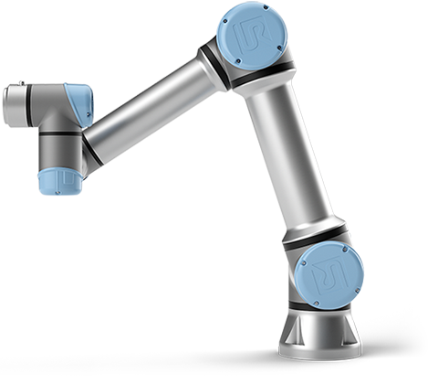
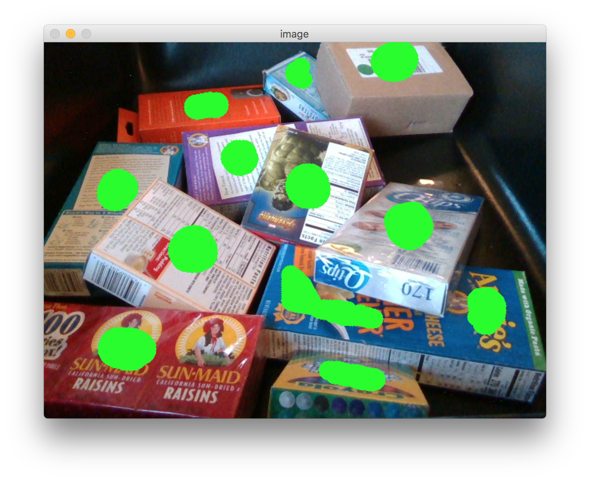
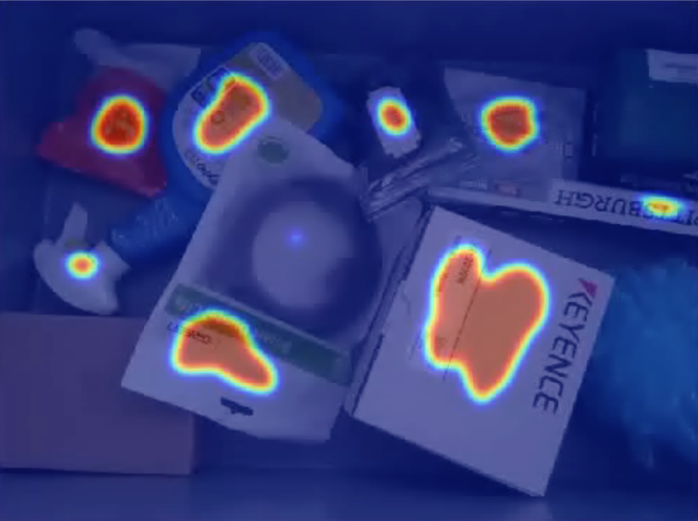

## Welcome to the Nimble AI Programming Challenge

<p align="center">
 
</p>

The goal of this project is develop an algorithm that can predict ideal suctionable areas in cluttered scenes. Suction cups adhere best to flat, smooth and non-porous surfaces -- so something like a sponge wouldn't work since the air would escape from the holes.

<p align="center">
 
</p>

For example, in the RGB image above, the green areas indicate locations where a suction cup would have maximal gripping success.

Your goal is to train a model that takes as input an RGB-D (rgb + depth) image and outputs a corresponding affordance map of values between 0 and 1 for each pixel in the input image, where values closer to 1 indicate more favorable locations for suction. These affordance maps should be visualized as heatmaps as shown in the  example below. 

<p align="center">
 
</p>

**Note 1**. You have the liberty of choosing what modality to use: you may choose to work with depth images alone, rgb images alone, or both modalities combined.  You may also pre-process the inputs if you'd like before feeding them to a model. If you do so please elaborate on what you are doing and why it helps with learning.

**Note 2**. We don't want an overly-parameterized network, so try to avoid pretrained Imagenet variants. We prioritize both accuracy (more specifically precision) and runtime. Be mindful of potential class imbalance when training your networks.

## Given

**1)** We've provided you with an inhouse dataset composed of RGB and Depth images of size `480x640` and their associated labels. Split the data into train and validation sets following standard rules of thumb. 

* `data/train/color/`: contains 465 training images in 24-bit PNG format.
* `data/train/depth/`: contains 465 training images in 16-bit PNG format.
* `data/train/label/`: contains 465 training labels in 8-bit grayscale PNG format.
* `data/test/color/`: contains 35 test images in 24-bit PNG format.
* `data/test/depth/`: contains 35 test images in 16-bit PNG format.
* `utils.py`: contains an example function for loading an RGB image, a Depth image and a label.

## Deliverables

A folder containing the output grasp affordance or 'heat' maps (i.e. pixel-wise probabilities) on the test set. They should be in the same format as the example heatmap shown above saved as PNGs. Additionally please provide a link and invite me as a collaborator (github: skalouche) to a **private** GitHub repo with your solution and a README describing:

*  your implementation details. This includes a description of things like model architecture, loss function, inputs modalities used, data augmentation (if any), reference papers used, etc.
*  what other approaches you would try if given more time.
*  quick instructions on how to run your code.


```
│----test-labels
│     │---- 0.png
│     │---- 1.png
│     │---- ...
│
```


## Evaluation

We'll be evaluating your results using 3 metrics:

* `overall accuracy`: the average overall accuracy
* `per class accuracy`: the average per class accuracy
* `precision`: the average precision

**Why do we care about the precision?** In robotic manipulation, the cost of a false positive is high because it leads to failed grasp attempts. Hence we prefer "restrained" prediction over false, "reckless" predictions.


## GPU Access

We provide the AWS credentials for access to an **Oregon region** EC2 p2.xlarge GPU instance. 

You can access the instance using the web interface or via the following terminal command. Please ensure that `applicationKeyPair.pem` is at the working directory.

`ssh -i "applicantKeyPair.pem" ubuntu@ec2-54-202-136-229.us-west-2.compute.amazonaws.com`

**PLEASE MAKE SURE TO STOP THE INSTANCE WHEN YOU ARE DONE TRAINING**

## Submission by PRTAEEK AGRAWAL

### Instruction to run the code

**Packages Required:**
* Tensorflow 2.1
* tqdm: install using pip install tqdm
* glob
* os
* shutil
* numpy
* opencv2
* argparse
* python 3.4

**To run the code:**

**1)** Copy all the data in the `data` folder as provided for the hackathon

**2)** Navigate to the `suction-challenge-master`

**3)** Run `python main.py --mode train` to train the model (default values are already set in the code)

**4)** The code will create a folder `log` and store the saved model inside it

**5)** To run prediction on the test images, create a folder `output` inside `suction-challenge-master`

**6)** Run `python main.py --mode predict --model_path path_to_trained_model`

**7)** All the outputs will be saved in the `output` folder

### Implementation details

* Tensorflow's dataset API is used to stream continuous batch of data for training and validation. 
* The model architecture is an encoder-decoder approach, where the encoder is a pretrained VGG16 with fully connected
layers removed. 
 * The decoder is combination of 1x1 convolutions, Skip connection from pooling layer 3 and pooling layer 4
of the vgg16 network and transpose operation.
* This network is very close to the FCN-8 network used for semantic
segmantation. 
* For the current implementation I am using **Adam** optimizer with learning rate **1e-4** and a **batch size of 8**.
The images are resized to **240x320** and normalized by division of **255.0**. Output is converted from an RGB image to 
  single dimension with only Green channel inside it. 
 * I have used most the default parameters given the time constraint.

**Current precision of the model is around 63% and the model in over-fitting after training for some epochs**

### Further improvements

* Usage to regularization approach such as drop out, l2 norm and batch normalization should be applied to avoid over 
fitting 

* Also, There is a lot of room for improvement in the network architecture, current architecture is complex and has
 a lot of parameter, hence the model overfits.
 
* Hyper Parameter optimization for parameters like learning rate, batch size, kernel size and transpose operations should 
lead to a better precision

* Given the time constraint my focus was on being able to understand the problem and demonstrate the ability to read and 
replicate a research paper with a neat code. This code and the model is no where close to production and needs further 
  refinements.
  
* Possibility of using depth should also be explored next.

### Resources used

* https://github.com/udacity/CarND-Semantic-Segmentation
* https://arxiv.org/abs/1411.4038
* https://www.tensorflow.org/
* https://github.com/Gurupradeep/FCN-for-Semantic-Segmentation

 


